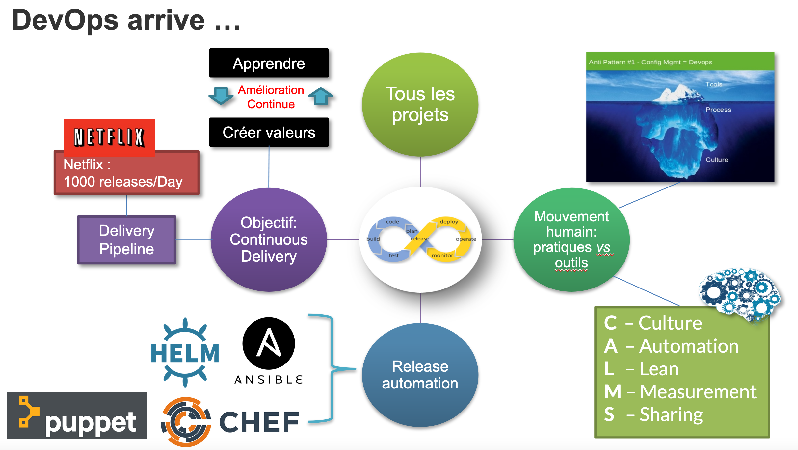
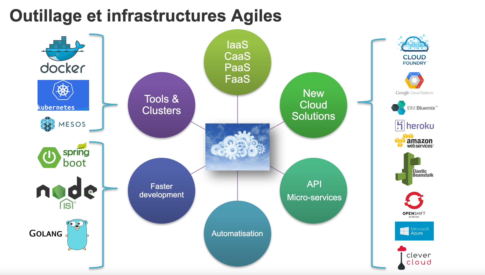
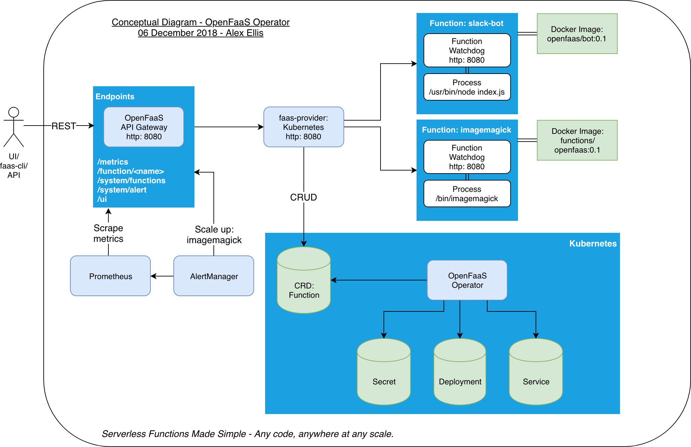
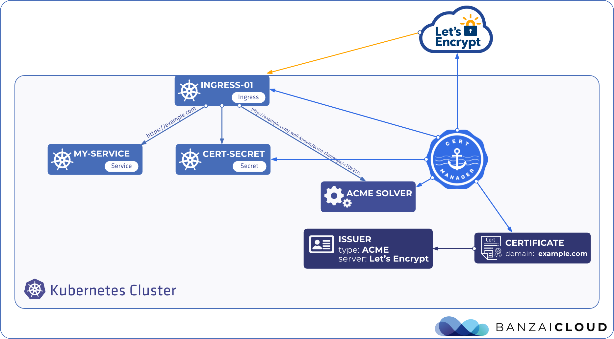

# Retours d'expérience Kubernetes et DevOps

Interventions autour des micro-services et Kubernetes avec une vision d’usage des entreprises du privé.

**Slides:** http://jamkey.fr/devops-k8s-training

**Sources:** https://github.com/sebastienmoreno/devops-k8s-training


---

# Intervention 1/3
*Mardi - durée ~2h*

<table><tr><td>

- Pourquoi DevOps?
- Pourquoi les micro-services?
- Le futur des micro-services
- La “MEP”
- Evolution des technos
- Time-to-market
- Maitriser son Infra
- Maîtriser les déploiements

</td><td width="50%">


</td></td></table>

--

<center>  <h1>DEVOPS</h1> </center>

--

## Pourquoi DevOps

DevOps est une culture, un mouvement ou une pratique qui met l'accent sur la ***collaboration et la communication*** des développeurs et des autres professionnels de l'IT, tout en automatisant le processus de livraison des logiciels et de modification des infrastructures. 

Bon nombre des idées (et des personnes) impliquées dans DevOps sont issues des mouvements ***agiles***.

Au cours des derniers mois, un mouvement a commencé à prendre forme. Il s'agit d'un mouvement de personnes qui pensent qu'il est temps de changer l'industrie informatique - il est temps d'arrêter de gaspiller de l'argent, de commencer à fournir de bons logiciels et de construire des systèmes qui évoluent et durent. **Ce mouvement est appelé Devops.**

**Patrick Debois, Agile 2008 conférence -> “Agile infrastructure”**

> source: http://www.jedi.be/blog/2010/02/12/what-is-this-devops-thing-anyway/

--


--

## Avant DevOps

<table>
<tr><td>


</td><td>

- Déploiements compliqués et risqués
- Peur du changement *(rex)*
- Mise en prod périlleuses
- "Ça marche sur ma machine !"
- Silos ... beaucoup de silos! *(rex)*
- Pas de visibilité sur la qualité ou viabilité du développement

</td></tr></table>

--


--


--



--




--

## Et aussi des outils (beaucoup...) !


> source: [devops-tools-periodic-table](https://digital.ai/devops-tools-periodic-table)

--

## REX - Oracle Exadata

<table>
<tr><td width="30%">


</td><td>

- Entreprise de "Web Analytics" besoin d'améliorer exploitation, innovation et Time to market.
- Pour répondre à des exigences plus fines et plus spécifique des clients.
- Aussi pour répondre à la concurrence : gros acteurs et start-up innovantes.
- Besoin de + d'agilité (+ de release), innovation, DevOps, orienté client.
 

**Achat d'un rack Oracle Exadata:**
- A coûté très cher
- Pas permis de faire les évolutions souhaitées
- Plus de compétences rates nécessaires
- Scalabilité difficile

**Au final**: 
- Retour arrière après 6 mois de mise en oeuvre.
- On pris conscience que le Cloud leur permettrait d'expérimenter sans coût important.

</td></tr></table>

--

## Devops aujourd'hui

<table>
<tr><td>

- Prise de conscience collective: Devops pousse des pratiques essentielles pour gérer les ressources permettant les mises en prod
- Certains points de vue plus tranchés: sans DevOps = mort du business assuré
- Outils bien installés: IaC, Cloud...
- Cloud Hybrid, Multi-Cloud
- Formations et centres d'excellence
- Audit de maturité pour mesurer la performance
- Economie d'échelle
- Met en plus avant la **Sécurité**
- Changement culturels: pas toujours en place


</td><td>


</td></tr></table>

> source: https://services.google.com/fh/files/misc/state-of-devops-2019.pdf

--

<center>  <h1>MICROSERVICES</h1> </center>

--

## Exemple Uber : monolithe


> [Source DreamFactory](https://blog.dreamfactory.com/microservices-examples/) 

--

## Exemple Uber : microservice


--

## Uber’s microservices architecture from 2019


--

## Equipe fonctionnelle

| Equipe fonctionnelles | Données décentralisées |
|---|---|
|  |  |

> [Source Martin Fowler](https://martinfowler.com/articles/microservices.html) 

--

## Exemple 

<table><tr><td>

- Back-end de votre site Web soit au **max de sa capacité** 
- Front-end et le stockage **ne soient pas sollicités**. 

=> vous pouvez faire évoluer le back-end séparément pour améliorer les performances.

=> vous pourriez également choisir de changer le service de stockage ou de modifier le front sans avoir d'impact sur les autres composants.

</td><td>

[](https://excalidraw.com/#json=wMSlHJT6fQ4LfCVy7KWzy,Lxer_6owaKRNxOq8_vG6nA)

</td></tr></table>

--

## Comment on est arrivé aux micro-services? 

L'arrivée de la notion de microservices est complémentaire à DevOps.

L'idée première était d'avoir:
- une production plus facilement mise à jour
- réduire le time-to-market
- moins d'impacts en cas de problèmes
- d'être plus libre des technologies utilisées (Java, JS, Go...)
- une séparation des responsabilités par une plus grande modularité
- mise à l'échelle (scaling)

--

## Micro-services

Des services API Rest / Asynchrones ayant des domaines de responsabilité bien déterminés.


> source: [microservices-orchestration-with-kubernetes](https://faun.pub/microservices-orchestration-with-kubernetes-1cbb737cfa46)

--


--

## Avantages et inconvenients

<table><tr><td>

**Avantages**
- Amélioration de la scalability
- Amélioration de l'isolation des erreurs
- Agnostique au langage de programmation et technologie
- Déploiement plus simple
- Possibilité de réutilisation dans différents domaines d'activité
- Mise sur le marché plus rapide (time to market)
- Possibilité d'expérimenter
- Amélioration de la sécurité des données
- Flexibilité pour le outsourcing
- Optimisation des équipes
- Attractif pour les ingénieurs
  
</td><td>

*Inconvénients*
- Les coûts initiaux sont plus élevés avec les microservices
- Le contrôle des interfaces est crucial
- Un autre type de complexité
- Tests d'intégration
- SOA vs microservices

</td></td></table>

> [source Gitlab](https://about.gitlab.com/blog/2022/09/29/what-are-the-benefits-of-a-microservices-architecture/)

--

## Stratégie autour des micro-services

**Organisation:**
- Séparer les responsabilités techniques (Bounded Context - architecture Hexagonale)
- Pizza team

**Positif:**
- Rapidité de développement
- Couplages lâches entre les services permet évolution
- Flexibilité des technos
- Scalabilité

**Négatif:**
- Ne résoud pas tous les problèmes (au contraire)
- Complexité de mise en oeuvre: dev et déploiement
- Archi plus complexe, parfois inutilement!
- Couplages et monolithes distribué
- Migroservices : faux microservices

--

## Micro-services aujourd'hui

- Culture du micro-service en place pour des third-party (OAuth, Messaging, database...)
- Revenir aux archis hexagonales pour mieux gérer le passage aux micro-services
- Retour aux monolithes? En tout cas mieux gérer la modularité et la complexité!
- Beaucoup de REX permettent de mieux gérer les situations
- Utilisation de **nanoservices** dans des cas de scaling très forts *(rex)*

--

## Le futur des micro-services: 

- Usage plus maitrisé des micro-services (monolithes plus facile a gérer)
- Utilisation des FaaS (rex) dans des cas précis
- Répartition services synchrones / asynchrones
- Stack technique plus légère et rapide (QuarkusIO)

--

<center>  <h1>LA PRODUCTION / DELIVERY</h1> </center>

--

## Qu’est-ce que la “production”? 

**Mise en production ou MEP**

- Moment le plus tendu d'un projet: *Casser la prod*
- Dev + Infra + Environnement + Data + Sécurité
- Intégration Continue (CI : Continuous Integration) pour tester en avance des MEP
- Continuous Delivery (CD) pour gérer Build / Tests et déploiement

**Process de MEP:**
- Promotion: builder une fois et passer d'un environnement à l'autre (Intégration -> Preprod -> Prod) par validations
- Eviter les silos, mais passer par une validation manuelle

--

## Infrastructure

- Infras de plus en plus complexes: *cloud, cloud hybrides, multi cloud...*
- Problématique d'où sont stockées les données: *sécurité, droits, performance...*
- **Obligatoire** de maîtriser son infra par IaC: *Terraform, Ansible...*
- Sécurité: mise à jour OS, libs, etc
- Observabilité: *monitoring, tracabilité (Open Telemetry)*

**Les infrastructures locales sont moins agiles:**
- moins flexibles pour du lab/test
- nécessitent plus de maintenance
- moins rapides à mettre à jour (patchs sécurité...)
- moins disponibles

--

## Maitriser ses déploiements

- Gestion des déploiement par scripts ou CI: possible mais complexe et maintenance importante
- Architectures complexe: Besoin de cartographie
- GitOps: services déployés à l'image des descriptions Git
- Testabilité du déploiement

*Il est devenu essentiel dans les projets actuels d'avoir une souplesse et maitrise de ses déploiements.*

--

# Questions ?


---

# Intervention 2/3
*Mercredi soir - durée ~1h*

<table><tr><td>

- Kubernetes dans le privé
- L’écosystème Kubernetes
- Facilité la MEP
- Stateless / Stateful
- Persistence
- Ecosystème élargie

</td><td width="50%">


</td></tr></table>

--

<center>  <h1>KUBERNETES</h1> </center>

--

## Position Kubernetes


--

## Kubernetes dans le privé

Adoption de Kubernetes dans les entreprises du privé: 
- Présence de + en + forte
- **Engouement des organisations**: devient un standard du marché, orienté *containers*, orienté *microservices*, polyvalence de l'architecture, HA, integration dans les Cloud publics

<center></center>

--


--

## Concepts et ressources

Les concepts de cluster facilite l'adoption:
- Ressources API: Deployment, Service, Pod...
- Stateless/Stateful: implications pour les mise en production
- Couplage lâche entre les ressources: infrastructure flexible


--

## Kubernetes load-balancing


--

## Mais...

- Installation difficile (notamment pour edge, CI, test)
- Paramétrage complexe, 1ere expérience d’utilisation difficile
- Consommation ressources système importante
- Difficile à utiliser sur des environnements légers (IoT, Edge, ARM)
- Difficulté d'apprentissage par les devs
- Monitoring complexe


--

## Solutions

<table><tr><td width="70%">

*Communauté très active:*

- Intégrations dans les offres cloud: EKS, AKS, GKE...
- Outillage: Kubespray, Terraform, Kops, Rancher...
- Utilisation d'un PaaS qui encapsule Kubernetes: OKD, Rancher
- Distribution alternative: K3S...
- Distribution pour faciliter le dev: K0S, K3D / K3S, microk8s ...

</td><td>

[k3s:<br><br>https://youtu.be/9Jbxi_lz5tM](https://youtu.be/9Jbxi_lz5tM)

</td></tr></table>

--

## Cas d'utilisations

**Déploiement:**
- Déploiement de microservices: plateforme idéale pour ça (stateless, stateful)
- Agnostiques aux runtimes: idéal pour solutions riches (eg.: processing)
- Adaptable: deployment, jobs, cron, stateful/stateless
- Synchrones: Service Frontend / Backend API
- Asynchrones: Messages, MQTT, Streams
- Plateforme multi-solutions, multi-équipe *(rex)*
- Workflow *(rex)*

**Infrastructure:**
- Scaling
- Resilience
- Facilité de mise à jour des services

--

## Exemple d'architecture


--

<center>  <h1>Ecosysteme</h1> </center>

--

## Ecosystème

**L'écosystème autour de Kubernetes est tellement riche qu'il s'agit plus d'un ensemble d'écosystèmes.**

*Distributions:* K8S, K3S, Rancher, Openshift...

*Ingress / API Gateway:* Traefik, NGINX, HAProxy, Kong, Istio, LinkerD, Consul...

*Persistence:* StorageClass: GlusterFS, Minio

*FaaS:* OpenFaaS, Fission, Knative, Kyma...

*Asynchrone / Workflow:* Keda, Kubeflow, Kyma

*Deploiement:* Helm, Kustomize, FluxCD (GitOps)

*Observabilité:* Prometheus / Grafana, Sysdig...

*Sécurité:* Cert-manager, Istio...

--

[](https://landscape.cncf.io/)

--


## Service mesh : Istio

<table><tr><td>

- Traffic management
- Observability
- Security capabilities

</td><td>


</td></tr></table>

--

## Mettre en prod... dans le calme!

Les services-mesh avec Kubernetes permettent une mise en prod "en douceur".

Cas d’usages:
- Test A/B 
- Blue-Green
- Canary

--

## AB Tests


> [source: Isak Kabir](https://towardsdatascience.com/how-to-conduct-a-b-testing-3076074a8458)

--

## Blue Green


> [source: Flexagon](https://flexagon.com/blog/k8s-deployment-strategies-bluegreen-to-a-b/)

--

## Canary


> [source: Jason Skowronski](https://dev.to/mostlyjason/intro-to-deployment-strategies-blue-green-canary-and-more-3a3)

--

## Persistance

<table><tr><td>

L'API PersistentVolume gère la façon dont le stockage est fourni et comment il est consommé :
- **PersistentVolume** (PV) : pièce de stockage provisionnée dans le cluster.
- **PersistentVolumeClaim** (PVC) : une demande de stockage.

**StorageClass** décrit les "classes" de stockage dynamiquement disponibles.

Les types de **PersistentVolume** sont implémentés sous forme de plugins : GlusterFS, NFS, AWSElasticBlockStore, AzureFile, GCEPersistentDisk, Flocker...

</td><td width="60%">


</td></tr></table>

--

## Persistent Volume Claim

D'un point de vu utilisateur, on déclare un **PVC** qui demande une capacité de stockage.
Le **PersistentVolume** résultant est monté en tant que volume dans le **Pod**.

<table><tr><td>

*<center>PersistentVolumeClaim</center>*

```yaml
apiVersion: v1
kind: PersistentVolumeClaim
metadata:
  name: data
spec:
  resources:
    requests:
      storage: 100Mi
  storageClassName: myclaim
```

</td><td width="60%">

*<center>Pod</center>*

```yaml
apiVersion: v1
kind: Pod
metadata:
  name: mypod
spec:
  containers:
    - name: myfrontend
      image: nginx
      volumeMounts:
      - mountPath: "/var/www/html"
        name: mypvc
  volumes:
    - name: mypvc
      persistentVolumeClaim:
        claimName: myclaim
```

</td></tr></table>

--

## StorageClass

| Volume Plugin        | Internal Provisioner |  Config Example  |
|----------------------|:--------------------:|:----------------:|
| AWSElasticBlockStore |           ✓          |      AWS EBS     |
| AzureFile            |           ✓          |    Azure File    |
| AzureDisk            |           ✓          |    Azure Disk    |
| CephFS               |           -          |         -        |
| Cinder               |           ✓          | OpenStack Cinder |
| FC                   |           -          |         -        |
| FlexVolume           |           -          |         -        |
| GCEPersistentDisk    |           ✓          |      GCE PD      |
| Glusterfs            |           ✓          |     Glusterfs    |
| iSCSI                |           -          |         -        |
| NFS                  |           -          |        NFS       |
| RBD                  |           ✓          |     Ceph RBD     |
| VsphereVolume        |           ✓          |      vSphere     |
| PortworxVolume       |           ✓          |  Portworx Volume |
| Local                |           -          |       Local      |

--

<center>  <h1 style="color:red">demo?</h1> </center>

--

<center>  <h1>Ecosystème élargie</h1> </center>

--

## Web IU, TUI et GUI

<table><tr><td>

**Web UI:**
- Kubernetes dashboard
- Octant
- ...

**Ligne de commande:**
- kubectl
- k9s
- ...

**GUI:**
- Lens
- Kubevious
- Aptakub
- ...

</td><td>


</td></tr></table>

> [Détails sur le blog de zwindler](https://blog.zwindler.fr/2022/02/21/webui-tui-gui-pour-kubernetes-episode-01/)

--

## Ecosystème élargie : OpenFaas


> [Source OpenFaas](https://docs.openfaas.com/architecture/invocations/)

--

## Exemple OpenFaaS



--

## Ecosystème élargie : Fission


> [Source Platform9](https://platform9.com/blog/introducing-fission-platform-run-functions-anywhere/)

--

## Demo Fission

**BDX I/O 2019 - Une fonction Quarkus déployée dans un Kubernetes K3S avec Fission…**

[](https://www.youtube.com/watch?v=DZSGaGEhGFE)

--

## Ecosystème élargie : KubeFlow

Le projet Kubeflow a pour objectif de rendre les déploiements de machine learning (ML) workflows sur Kubernetes simples, portables et évolutifs.


> [Source NVidia](https://betterprogramming.pub/kubeflow-pipelines-with-gpus-1af6a74ec2a)

--

## Ecosystème élargie : Keda


<table><tr><td width="40%">

**Keda** est construit pour être capable d'activer un déploiement Kubernetes en fonction d'événements provenant de diverses sources d'événements (RabbitMQ, Kafka, Pulsar...).
Il peut aussi scaler le nombre de pods en fonction de la charge.


> [Source Keda](https://keda.sh)

</td><td>


</td></tr></table>

--

# Questions ?


---

# Intervention 3/3

*Jeudi le matin - durée 1h30*

<table><tr><td width="50%">

- Deploiement
- Integration: 
  - Ingress
  - API
  - Messages
- Observabilité
- Sécurité

</td><td>


</td></tr></table>

--

<center>  <h1>DEPLOYMENT</h1> </center>

--


--


--

## Deploiement: manifests Kubernetes

<table><tr><td>

*<center>Deployment</center>*
```yaml
apiVersion: apps/v1
kind: Deployment
metadata:
 name: nginx-deployment
 labels:
   app: nginx
spec:
 replicas: 3
 selector:
   matchLabels:
     app: nginx
 template:
   metadata:
     labels:
       app: nginx
   spec:
     containers:
     - name: nginx
       image: nginx:1.7.9
       ports:
       - containerPort: 80
```

</td><td>

*<center>Service</center>*
```yaml
kind: Service
apiVersion: v1
metadata:
 name: my-service
spec:
 selector:
   app: MyApp
 ports:
 - protocol: TCP
   port: 80
   targetPort: 9376
```

</td></tr><tr><td colspan="2">

*<center>Application des manifests:</center>*
```sh
kubectl apply -f deployment.yaml -f service.yaml
```

</td></tr></table>

--

## Deploiement: Kustomize
### Composing

<table><tr><td>

*deployment.yaml*
```yaml
apiVersion: apps/v1
kind: Deployment
metadata:
  name: my-nginx
spec:
  selector:
    matchLabels:
      run: my-nginx
  replicas: 2
  template:
    metadata:
      labels:
        run: my-nginx
    spec:
      containers:
      - name: my-nginx
        image: nginx
        ports:
        - containerPort: 80
```

</td><td>

*service.yaml*
```yaml
apiVersion: v1
kind: Service
metadata:
  name: my-nginx
  labels:
    run: my-nginx
spec:
  ports:
  - port: 80
    protocol: TCP
  selector:
    run: my-nginx
```

</td><td>

*kustomization.yaml*
```yaml
resources:
- deployment.yaml
- service.yaml
```

</td></tr><td colspan="3">

*Application Kustomize:*
```sh
kubectl apply -k src/manifests
```

</td></tr></table>

--

## Deploiement: Kustomize
### Configmap Generator

<table><tr><td>

*kustomization.yaml*
```
configMapGenerator:
- name: example-configmap-3
  literals:
  - FOO=Bar
generatorOptions:
  disableNameSuffixHash: true
  labels:
    type: generated
  annotations:
    note: generated
```

</td><td>

*résultat:*
```yaml
apiVersion: v1
data:
  FOO: Bar
kind: ConfigMap
metadata:
  annotations:
    note: generated
  labels:
    type: generated
  name: example-configmap-3
```

</td></tr></table>

--

## Deploiement: Kustomize
### Patch

<table><tr><td>

*deployment.yaml*
```yaml
apiVersion: apps/v1
kind: Deployment
metadata:
  name: my-nginx
spec:
  selector:
    matchLabels:
      run: my-nginx
  replicas: 2
  template:
    metadata:
      labels:
        run: my-nginx
    spec:
      containers:
      - name: my-nginx
        image: nginx
        ports:
        - containerPort: 80
```

</td><td>

*kustomization.yaml*
```yaml
resources:
- deployment.yaml
images:
- name: nginx
  newName: my.image.registry/nginx
  newTag: 1.4.0
```

</td><td>

*résultat:*
```yaml
apiVersion: apps/v1
kind: Deployment
metadata:
  name: my-nginx
spec:
  replicas: 2
  selector:
    matchLabels:
      run: my-nginx
  template:
    metadata:
      labels:
        run: my-nginx
    spec:
      containers:
      - image: my.image.registry/nginx:1.4.0
        name: my-nginx
        ports:
        - containerPort: 80
```

</td></tr></table>

--

## Deploiement: Helm

<table><tr><td>

*Helm* est un outil de gestion des paquets Kubernetes appelés *charts*.

- Créer de nouveaux charts à partir de zéro
- Packager des charts dans des archives (tgz)
- Interagir avec les dépôts de charts où les charts sont stockées.
- Installer et désinstaller des charts dans un cluster Kubernetes existant
- Gérer le cycle de *release* des charts qui ont été installés avec Helm
- Lancer des *smoke tests* sur les releases de charts installés


</td><td width="20%">


</td></tr></table>

--


--

<center><h1 style="color:red;">DEMO</h1></center>

--

## Opérateurs


- Contrôleur Kubernetes spécifique à une application
- Permet de créer, configurer et gérer des instances d'applications complexes par l'API Kubernetes
- Utilise des ressources personnalisées (CRD) pour gérer des applications et leurs composants

--

## Opérateurs


> Source: https://blog.codecentric.de/kubernetes-operators-helm

--

## Exemple d'opérateur: Elastic-Stack

Une fois l'opérateur déployé: pod + CRD, on utilise des instances de ressources

<table><tr><td width="30%">

*<center>Elasticsearch:</center>*
```yaml
apiVersion: elasticsearch.k8s.elastic.co/v1
kind: Elasticsearch
metadata:
  name: elasticsearch-sample
spec:
  version: 8.5.0
  nodeSets:
    - name: default
      config:
        node.roles:
          - master
          - data
        node.attr.attr_name: attr_value
        node.store.allow_mmap: false
      podTemplate:
        metadata:
          labels:
            foo: bar
        spec:
          containers:
            - name: elasticsearch
              resources:
                requests:
                  memory: 4Gi
                  cpu: 1
                limits:
                  memory: 4Gi
                  cpu: 2
      count: 3

```

</td><td width="30%">

*<center>Beat:</center>*
```yaml
apiVersion: beat.k8s.elastic.co/v1beta1
kind: Beat
metadata:
  name: heartbeat-sample
spec:
  type: heartbeat
  version: 8.5.0
  elasticsearchRef:
    name: elasticsearch-sample
  config:
    heartbeat.monitors:
      - type: tcp
        schedule: '@every 5s'
        hosts:
          - 'elasticsearch-sample-es-http.default.svc:9200'
  deployment:
    replicas: 1
    podTemplate:
      spec:
        securityContext:
          runAsUser: 0
```

</td><td width="30%">

*<center>Kibana:</center>*
```yaml
apiVersion: kibana.k8s.elastic.co/v1
kind: Kibana
metadata:
  name: kibana-sample
spec:
  version: 8.5.0
  count: 1
  elasticsearchRef:
    name: elasticsearch-sample
  podTemplate:
    metadata:
      labels:
        foo: bar
    spec:
      containers:
        - name: kibana
          resources:
            requests:
              memory: 1Gi
              cpu: 0.5
            limits:
              memory: 2Gi
              cpu: 2
```

</td></tr></table>

> Source: https://operatorhub.io/operator/elastic-cloud-eck

--

## Integration continue

L'intégration continue est portée par les "pipelines" scriptés ou déclaratifs sur le code source.


--


--

## Déploiment: GitOps

- Continuous Delivery / Continuous Deployment
- Pas de scripts complexes portés par l'intégration continue
- Basé sur les outils de déploiement classiques et sur Git

> *Un référentiel Git qui contient toujours des descriptions déclaratives de l'infrastructure actuellement souhaitée dans l'environnement de production et un processus automatisé pour que l'environnement de production corresponde à l'état décrit dans le référentiel.*

> Kelsey Hightower

--


> Source https://techblost.com/what-is-gitops/

--

## Ce qu'apporte GitOps

- Déployer plus rapidement et plus souvent
- Récupération facile et rapide des erreurs
- Gestion simplifiée des secrets
- Déploiements auto-documentés
- Le partage des connaissances en équipe

--

## GitOps: les outils

- *ArgoCD* : Un opérateur GitOps pour Kubernetes avec une interface web
- *FluxCD* : L'opérateur GitOps pour Kubernetes par les créateurs de GitOps Weaveworks
- *Fleet* : Fleet est un opérateur GitOps à l'échelle. Conçu par Rancher pour gérer jusqu'à un million de clusters.
- *Gitkube* : Un outil pour construire et déployer des images docker sur Kubernetes en utilisant git push.
- *JenkinsX* : Continuous Delivery sur Kubernetes avec GitOps intégré.
- *Terragrunt* : Un wrapper pour Terraform pour garder les configurations DRY et gérer l'état à distance.
- *WKSctl* : Un outil de gestion de la configuration des clusters Kubernetes basé sur les principes de GitOps.
- *werf* : Un outil CLI pour construire des images et les déployer sur Kubernetes via une approche "push".
- *Gimlet* : Gimlet est un outil en ligne de commande et un tableau de bord qui regroupe un ensemble de conventions et de flux de travail correspondants pour gérer efficacement une plateforme de développement Gitops.

--

## Exemple GitOps: FluxCD

<table><tr><td>

*<center>GitRepository</center>*
```yaml
apiVersion: source.toolkit.fluxcd.io/v1beta2
kind: GitRepository
metadata:
  name: podinfo
  namespace: flux-system
spec:
  interval: 30s
  ref:
    branch: master
  url: https://github.com/stefanprodan/podinfo
```

</td><td>

*<center>Kustomize</center>*
```yaml
apiVersion: kustomize.toolkit.fluxcd.io/v1beta2
kind: Kustomization
metadata:
  name: podinfo
  namespace: test
spec:
  interval: 5m0s
  path: ./kustomize
  prune: true
  sourceRef:
    kind: GitRepository
    name: podinfo
  targetNamespace: default
```

</td><td>

*<center>Ou Helm</center>*
```yaml
apiVersion: helm.toolkit.fluxcd.io/v2beta1
kind: HelmRelease
metadata:
  name: podinfo-helm
  namespace: test
spec:
  interval: 5m
  chart:
    # Peut être aussi un repo Helm
    spec:
      chart: ./helm/charts/podinfo
      sourceRef:
        kind: GitRepository
        name: podinfo
      interval: 1m
  values:
    # Values a remplacer
```

</td></tr></table>

> Et aussi: Notifications, Webhook, Vault, intégration cloud

--


--

<center><h1>Integration</h1></center>

--

## Integration: Ingress, API, Messages

**Intégration:**
- Assemblage des services entre eux
- Gestion du couplage et des versions
- API synchrone
- Message asynchrone

--

## API

Définir son API avec OpenAPI Specification & Swagger Tools


--

## Ingress


--

## Ingress Controller

- AKS Application Gateway Ingress Controller
- Ambassador API Gateway is an Envoy-based ingress controller.
- Apache APISIX ingress controller is an Apache APISIX-based ingress controller.
- Avi Kubernetes Operator provides L4-L7 load-balancing using VMware NSX Advanced Load Balancer.
- The Citrix ingress controller works with Citrix Application Delivery Controller.
- Gloo is an open-source ingress controller based on Envoy, which offers API gateway functionality.
- *HAProxy Ingress* is an ingress controller for HAProxy. *(rex)*
- The *HAProxy Ingress Controller* for Kubernetes is also an ingress controller for HAProxy.
- *Istio Ingress* is an Istio based ingress controller. *(rex)*
- The *Kong Ingress Controller* for Kubernetes is an ingress controller driving Kong Gateway.
- Kusk Gateway is an OpenAPI-driven ingress controller based on Envoy.
- The *NGINX Ingress Controller* for Kubernetes works with the NGINX webserver (as a proxy).
- The Pomerium Ingress Controller is based on Pomerium, which offers context-aware access policy.
- The *Traefik Kubernetes Ingress provider* is an ingress controller for the Traefik proxy.
- Tyk Operator extends Ingress with Custom Resources to bring API Management capabilities to Ingress. Tyk Operator works with the Open Source Tyk Gateway & Tyk Cloud control plane.
- Voyager is an ingress controller for HAProxy.
- ...

--

## Choisir son Ingress Controller selon ses besoins

<center></center>

> Source: https://blog.palark.com/comparing-ingress-controllers-for-kubernetes/

--

## Ingress config

```yaml
apiVersion: networking.k8s.io/v1
kind: Ingress
metadata:
  name: simple-fanout-example
  annotations:
    nginx.ingress.kubernetes.io/rewrite-target: /
spec:
  rules:
  - host: foo.bar.com
    http:
      paths:
      - path: /foo
        pathType: Prefix
        backend:
          service:
            name: service1
            port:
              number: 4200
      - path: /bar
        pathType: Prefix
        backend:
          service:
            name: service2
            port:
              number: 8080
```

--

## Istio


> [Source](https://excalidraw.com/#json=NpR3zD8kImiNUB3Q8yUYY,76WeweiwvcGt1QVVBlMTSw)

--


--

## Message Queue

<table><tr><td>


</td><td>

*Avantages:*
- Backup
- Messages asynchrones
- Résilience
- Scalability

*Inconvénients:*
- Système plus complexe
- Format de message a mettre en place
- Surveillance essentielle du bus de messages
- Difficile de traiter en synchrone

</td></tr></table>

> Source: https://itzone.com.vn/en/article/microservice-why-use-message-queue/

--

## Asynch-API

Similaire à OpenAPI pour les messages asynchrones


--

## Bonnes pratiques

- Eviter un couplage trop fort des API de services
  - Sinon risque de monolithe distribué...
- Est ce le bon découpage de services? D'API?
  - Ateliers d'impact mapping
- Versioning : *Semantic Versionning* (eg.: X.Y.Z, 1.2.3...)
- Microservices: couplage minimal, messaging...

--

## A éviter: le monolithe distribué


> Source: https://www.techtarget.com/searchapparchitecture/tip/The-distributed-monolith-What-it-is-and-how-to-escape-it

--

<center><h1>Observabilité</h1></center>

--

## Observabilité

*Avec 10 micro-services ça va...*

*... mais avec 10000?*

**Monitoring est primordial à la mise en place d'architectures distribuées.**

- Souvent négligé sur des projets rapides
- Pourtant de nombreuses solutions existent sur le marché:

<table><tr><td width="70%">

**Logs:**
- Elastic Stack
- Graylog
- Loki
- Splunk
- ...

**Metrics and alerting:**
- Prometheus / Grafana
- InfluxDB with Kapacitor
- Sensu
- ...

</td><td width="70%">

**Global Monitoring:**
- NewRelic
- DataDog
- Sysdig
- ...

**Tracing (Open-Telemetry):**
- Jaeger
- Zipkin

</td></tr></table>

--

## Logs: exemple Elastic Stack


--

## Composants Elastic Stack


--

## Elastic : Kibana


--

## Metrics: exemple Prometheus


--

## Metrics: Grafana


--

## Tracing

- Une trace est un chemin de données/exécution à travers le système, et peut être considérée comme un graphe acyclique.
- Elle permet l'analyse des appels, traitements, requêtes... *(rex)*
- Les systèmes de tracing permettent aussi de suivre un *correlation-id* sur l'ensemble des traces.


--

## Tracing: exemple Jaeger


--

## Jaeger UI


--

<center><h1>Sécurité</h1></center>

--

## Sécurité externe

Sécurité externe:
- firewall
- cert-managers

--



--

## Sécurité interne

A l'intérieur du cluster des barrières de sécurité doivent être mise en place pour éviter un détournement des services.

- Sécurité du cluster: RootLess
- Sécurité des containers: RootLess, SecurityContext
- Vault pour les secrets: pas de mots de passe en clair mais des secrets dans un Vault
- service-mesh: pour autoriser les services à s'appeler entre eux et à l'extérieure
- service-account Kubernetes: pour controler l'appel des API Kubernetes


--

## Sécurité interne: Docker

<table><tr><td>

**Bonnes pratiques:**
- Utiliser user non *root*, limiter les privilèges
- Mot de passes transmis au run (par variable d'environnement)
- Image avec *minimum* runtime
- Mise à jour *régulière* de l'image
- Analyse *automatique* des failles sécurité, base d'image de confiance
- Build sans surplus (multi-stage)

</td><td>

```dockerfile
FROM alpine:3.12
# Create user and set ownership and permissions as required
RUN adduser -D myuser && chown -R myuser /myapp-data
# ... copy application files
USER myuser
ENTRYPOINT ["/myapp"]
```

</td></tr></table>

> Exemples: https://sysdig.com/blog/dockerfile-best-practices/

--

## Securité interne: Kubernetes

Mettre en place *SecurityContext* Kubernetes

<table><tr><td>

- Privilèges pour chaque containers
- Permissions sur volumes
- Seccomp profile ([Docker](https://docs.docker.com/engine/security/seccomp/) et [Kubernetes](https://kubernetes.io/docs/tutorials/security/seccomp/) )
- SELinux labels

</td><td>

```yaml
apiVersion: v1
kind: Pod
metadata:
  name: security-context-demo
spec:
  securityContext:
    runAsUser: 1000
    runAsGroup: 3000
    fsGroup: 2000
  volumes:
  - name: sec-ctx-vol
    emptyDir: {}
  containers:
  - name: sec-ctx-demo
    image: busybox:1.28
    command: [ "sh", "-c", "sleep 1h" ]
    volumeMounts:
    - name: sec-ctx-vol
      mountPath: /data/demo
    securityContext:
      allowPrivilegeEscalation: false
```

</td></tr></table>

> Voir https://kubernetes.io/docs/tasks/configure-pod-container/security-context/

--

## Sécurité interne: Service Mesh

- Chiffre le traffic avec [Mutual TLS](https://istio.io/latest/docs/ops/best-practices/security/#mutual-tls)
- Filtrer le trafic avc [Authorization policies](https://istio.io/latest/docs/ops/best-practices/security/#authorization-policies)
- Verification [TLS](https://istio.io/latest/docs/ops/best-practices/security/#configure-tls-verification-in-destination-rule-when-using-tls-origination)
- ...

> Exemples Istio: https://istio.io/latest/docs/ops/best-practices/security/

--


--

# Questions ?


